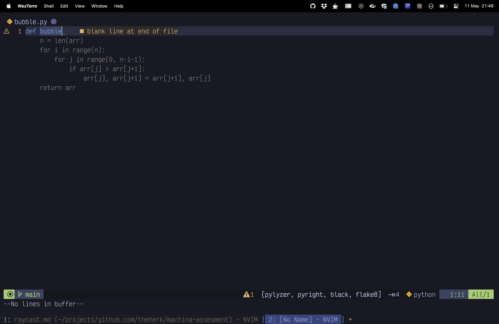
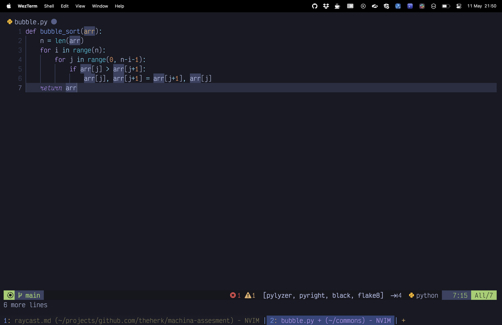
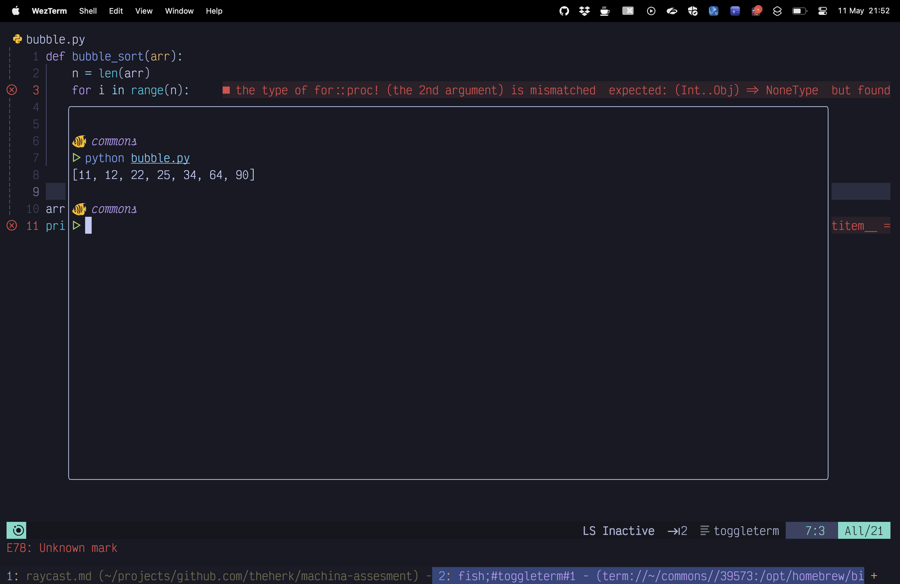
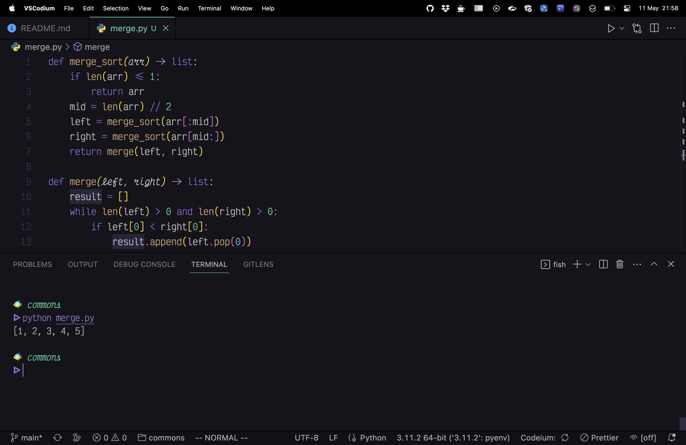
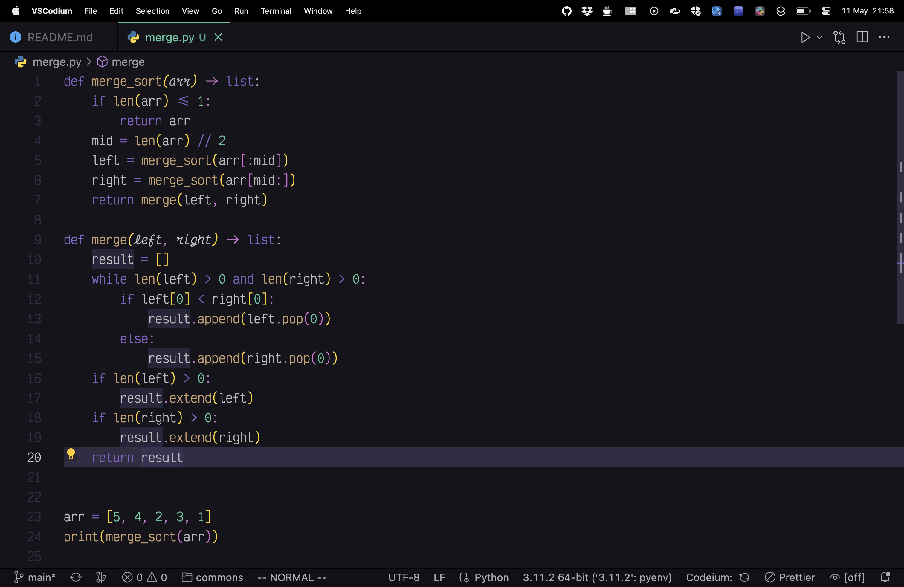

# Codeium

## Description 🌐

[Codeium](https://codeium.com/) is one of the tools that is both an in-editor code suggestion tool *and* a chat interface.

> Codeium has been developed by the team at [Exafunction](https://exafunction.com/) to build on the industry-wide momentum on foundational models. We realized that the combination of recent advances in generative models and our world-class optimized deep learning serving software could provide users with top quality AI-based products at the lowest possible costs (or ideally, free!).
>
> -- https://codeium.com/about

## Usage 🛠️

Codeium provides plugins for many editors for code completion, and is starting to rollout the chat interface to a few. Chat is avavailable only in VS Code or Codium at the moment, but it is coming to other platforms soon.

Nothing unexpected here. It reads your code and comments, and provides suggested continuations. You can open a chat panel on the side, where chat is available, and reason with it about your code. Chat is using OpenAI API's currently, but is creating their own model for this purpose. However, for autocomplete:

> Codeium Autocomplete uses proprietary models trained in house from scratch. There is no dependency on open-source models, OpenAI or other third party APIs, which allows our Enterprise offering to be completely self-contained. Codeium Search uses a small, local embedding model to generate the embeddings. The searches themselves are just queries over the resulting local embedding store. There are no third-party APIs used for Search. Codeium Chat currently uses third party OpenAI APIs, but we are working on our own large foundational models for this interaction modality.
>
> -- https://codeium.com/faq

## Benefits 🌟

What sets Codeium apart is that it is free for life for individual developers. In addition, they offer an enterprise version that offers "a fully self-hosted offering, with additional features like local personalization on your private repositories." This can optionally be fine-tuned on your own codebase.

One should check out their [AI Code Assistants: Head to Head](https://codeium.com/blog/code-assistant-comparison-copilot-tabnine-ghostwriter-codeium) for a nice show of its abilities, albeit obviously self-interested.

## Risks 😨

Since Codeium is both an autocomplete tool and a chat interface there are more varied risks. But is offers a fully self-hosted model, so those can be mitigated entirely if needed.

### Data Leakage 📤

Their claims.

> - ✅ You can opt out of code snippet telemetry at any time.
> - ✅ All communication is encrypted.
> - ✅ We will never train generative models on private data.

I have not performed traffic analysis, so I cannot be sure what data is outbound but they are pretty clear about how that data is handled.

> Codeium collects code snippet data to be used only for directly improving the functionality, usability, and quality of Codeium. This data only consists of limited contexts of code used for an inference, and Codeium will never contiguously store complete or large sections of a user's codebase. This data can only be directly accessed in extreme cases by authorized members of the Codeium team (2FA) for support requests, and similar to telemetry data, this data is not shared with, sold to, or used by any other party, company, or product. Research has shown that AI codegen rarely regurgitates training data due to user codebase specific stylistic conventions, and anecdotally, exact matching occurs only when there are near-universal implementations or where there is not enough context to derive stylistic effects from. That being said, Codeium does provide users with the option to opt out from allowing Codeium to store (and therefore use) their code snippet data post-inference. We will never train generative models on private Autocomplete data, and since Chat currently uses third party APIs, will not enable Chat if you choose to opt out from code snippet telemetry in order to respect your preferences.
>
> -- https://codeium.com/security

They are also actively working on SOC2 attestation.

### Legal Implications ⚖️

This is another place where Codeium seems to have a sane position. Since you data is not used to train their models, any suggestions that seem to be from your codebase are almost certainly based on universal implementations.

## Examples

While trivial, these example are less than 10 keystrokes away. And they work.

