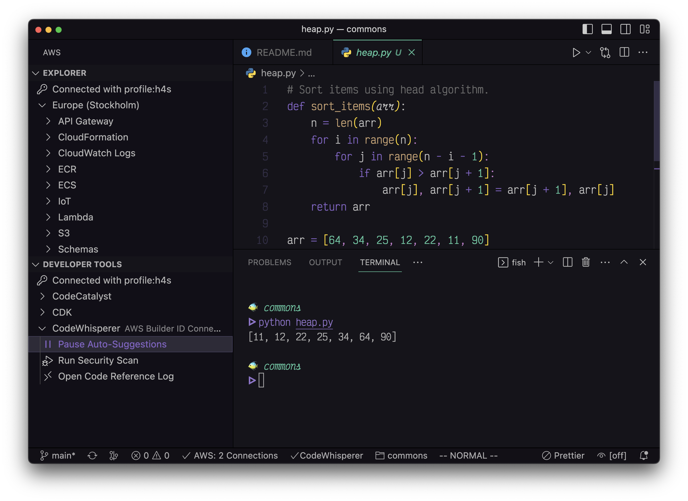

# Amazon CodeWhisperer

## Description 🌐

CodeWhisperer is an editor code assistant tool, not much unlike Copilot or Codeium.

> CodeWhisperer Individual Tier
>
> The CodeWhisperer Individual Tier is free to use. Individual developers can sign up and sign in using an email address with an AWS Builder ID to start using CodeWhisperer within minutes. The Individual Tier provides code suggestions, reference tracking, and security scans.
>
> CodeWhisperer Professional Tier
>
> In addition to the capabilities offered in the Individual Tier, the CodeWhisperer Professional Tier offers administrative capabilities to organizations that want to provide their developers with access to CodeWhisperer. Administrators get organizational license management to centrally manage which developers in the organization should have access to CodeWhisperer. They also get organizational policy management to set service policies at the organizational level, such as whether developers are allowed to receive code suggestions that may be similar to particular open-source training data.
>
> -- https://aws.amazon.com/codewhisperer/pricing/

## Usage 🛠️

Setup instruction can be found on their [Setting up](https://docs.aws.amazon.com/codewhisperer/latest/userguide/setting-up.html) page. It is currently significantly more limited than Codeium and Copilot with respect to editor support. But the setup for VS Code / Codium is very straight forward.

1. Install AWS Toolkit extention.
2. Click `Start` in the Developer Tools sidebar.
3. Login with Builder ID or SSO for enterprise.

That's it. From there, it offers code suggestions just like other assistant tools; based on context and comments.

## Benefits 🌟

CodeWhisperer has pretty good [language support](https://docs.aws.amazon.com/codewhisperer/latest/userguide/language-ide-support.html#language-support).

The primary benefits are that it is very well trained on AWS-specific knowledge, it offers references for its sources, it provides security scans, and it has tight integration with existing AWS solutions.

You can read its [Features](https://docs.aws.amazon.com/codewhisperer/latest/userguide/features.html) documentation for more information.

## Risks 😨

There are of course risks anytime you send data to a mothership, but AWS makes it pretty clear what goes where and how to disable this process.

### Data Leakage 📤

> When you use CodeWhisperer, AWS may, for service improvement purposes, store data about your usage and content. This page explains how to opt out of sharing that data.
>
> The data that AWS may collect with CodeWhisperer includes your client-side telemetry and your content.
>
> Your content includes the parts of your code that CodeWhisperer uses to generate suggestions, as well as the content of the suggestions themselves. At the professional tier, CodeWhisperer does not collect your content for service improvement purposes.
>
> Your client-side telemetry quantifies your usage of the service. For example, AWS may track whether you accept or reject a recommendation. Your client-side telemetry does not contain actual code, and does not contain personally identifiable information (PII) such as your IP address.
>
> -- https://docs.aws.amazon.com/codewhisperer/latest/userguide/sharing-data.html

This is immediately followed by how to disable this. Very clear.

On the topic of security, AWS seems to have the most robust and clear picture of the security model. It is worth checking out the documentation: https://docs.aws.amazon.com/codewhisperer/latest/userguide/codewhisperer-security.html.

## Example

Another trivial but illustrative demonstration.

And easy to pause at any time. Also, easy to stop *and* delete information usage.

