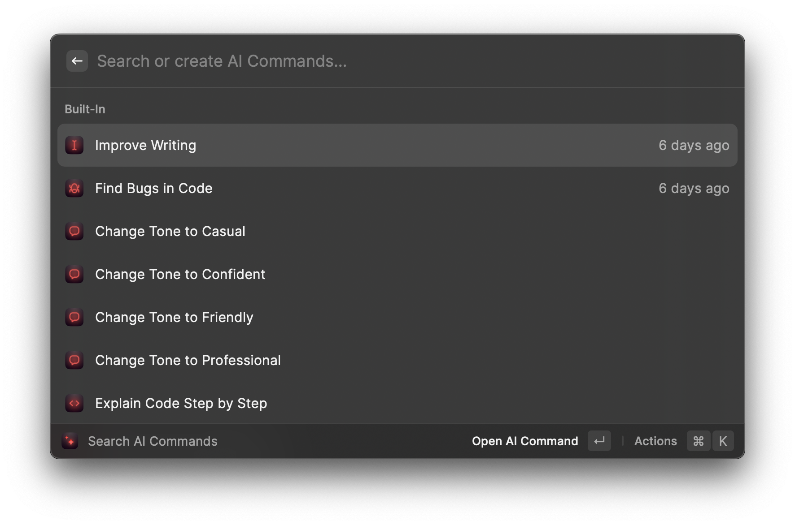

# Raycast

## Description 🌐

[Raycast](https://www.raycast.com/) is a launcher / hyperproductivity app for MacOS. From their site:

> Raycast is a blazingly fast, totally extendable launcher. It lets you complete tasks, calculate, share common links, and much more.

Think of it as a drop-in replacement for Spotlight. I used this before it did anything with AI, so I already recommend it as a fantastic part of your Mac workflow. For me `⌘ + Space` opens Raycast. It has many useful extensions. I can use it to open projects in code editors, manage pull requests in various git tools, convert to and from freedom units, manage window placement, and of course launch applications.

## Usage 🛠️

Initially, I was just using the extension [OpenAI GPT](https://www.raycast.com/simicvm/openai-gpt) which was a very nice way to get at GPT without having to open up a browser, but just recently they added a native AI implementation that is actually incredible. I am part of the beta, so I got to test it for free, but it is now being offered as a premium product. It is discussed here as part of the Pro Plan. https://www.raycast.com/pro

> - Ask anything, anytime, anywhere. Stuck while programming? Need some copy? Or just have a question - Ask AI.
> - Summarize text in any app, explain code in your favorite editor, or use intelligent extensions to achieve more.
> - Build, save, and share AI commands to eliminate chores. Just describe your task - no coding required.

> Raycast AI relies on different LLMs. We use OpenAI's GPT 3 and GPT 3.5-Turbo models as well as some other models.

## Benefits 🌟

You can create commands based on a prompt. For example, I have a command where, if I push `⌥ + t` it automatically uses my selected text as a prompt with "Translate this to Norwegian if it is in English or to English if it is in Norwegian:". It also comes built-in with many nice commands like:

- Improve Writing
- Find Bugs in Code
- Explain Code Step-by-step
- ... and many more

This is kind of nice because you can simply select what context is used to prompt the generator.

## Risks 😨

This is also a bit of a risk though because you need to be aware of what is on your selection clipboard when actuating one of these commands.

Otherwise, the risks are the same as using its underlying models. For $8/month, this is one of the most handy implementation I've seen to date.

### Legal Implications ⚖️

Legally we're on the same footing as its underlying models, but with an extra operator in the middle, we have one more hop to scrutenize. Fortunately, I had a nice conversation with one of the employees, and it went like this.

> theherk: Does this work by having access to the primary selection, and can that be set to use clipboard instead?

> thomas: Right now it’s just selection but we have an internal prototype to also allow the clipboard. More on that soon.

> theherk: Excellent. Thank you for the information. Is there anything provided for verification of outbound data. Even if not access to the source for auditing, it would be good if any research papers exist showing outbound traffic matches our expectations.
> I ask because I am on a team evaluating the use of AI within a company. Obviously I’m trialing personally primarily, but part of that evaluation is evaluating our exposure to accidental sharing of information. Any more information on the topic would be extremely helpful.

> thomas: You can see in the UI what selection got used.

> theherk: I don’t mean to be difficult, but we can see in the UI what selection the UI says it used. I assume they are the same, but it is critical this this be verifiable.

> thomas: How do you want to have it verifiable?

> theherk:
> - Best: Source code
> - Good: 3rd party audit
> - Minimum: Guarantees

> thomas: Well… We only send the minimum and don’t log any of it. We’re also planning to do some 3rd party audits. I guess we’re talking about SOC2?
> If your company really cares about this, can you not just observe the internet traffic? Or use a VPN? (edited)

> theherk: Most definitely, we can sniff the traffic, assuming it isn’t rewrapped in a way that prevents us from seeing it. But I was sort of hopeful, and remain so, that this can be done in the open. I think it would be good for adoption.
> I’m super pumped about it; I just know resistance will be high if everybody with compliance requirements has to inspect the traffic, rather than relying on audit’s and control being easily accessible. Thank you very much for taking the time with me.

So it sounds like they hadn't even really considered that they *could* send more data than they showed us they send, but there is no indication of spurious behavior here at all. On the contrary, the fact that they have open conversations with their users is itself a good sign.

## Examples

